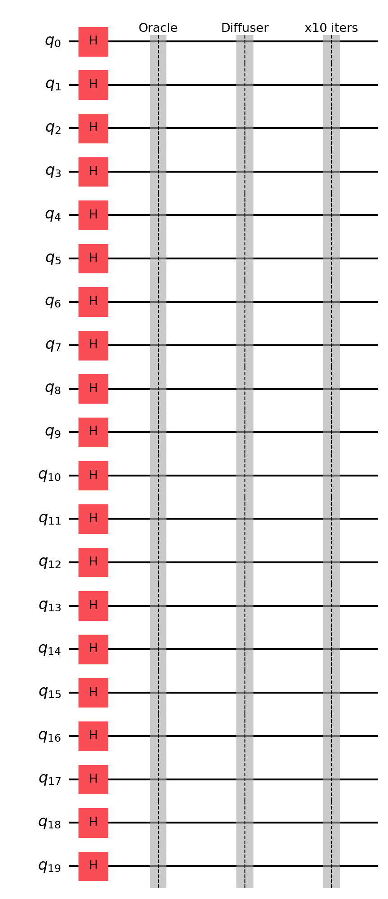
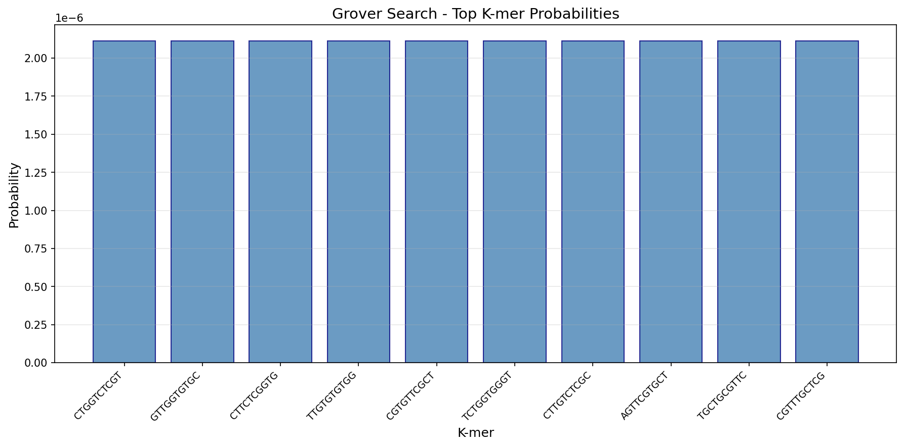
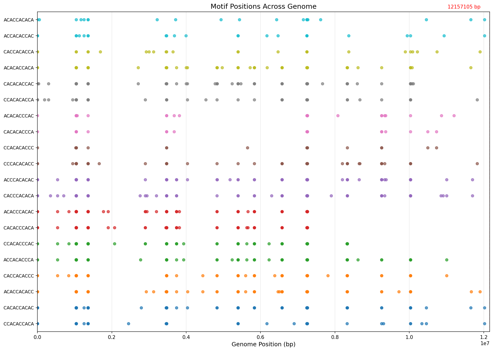

# Summary

Sequence motifs underpin many functional genomic elements, including transcription factor binding sites, promoters, and repeat structures. Practical workflows typically split into two tasks: (i) scanning a genome for occurrences of a known consensus motif, and (ii) discovering enriched short patterns (k-mers) that recur above background expectations [@stormo2000; @das2007]. `MotifQu` is a Python package and command-line tool that implements both tasks using Grover-style amplitude amplification [@grover1996], with circuits executed via Qiskit Aer's statevector simulator [@qiskit2024].

`MotifQu` provides two core subcommands: `motifqu search` for locating a user-specified motif with an optional Hamming-mismatch tolerance, and `motifqu discover` for identifying significant k-mers whose genome-wide counts exceed a user-defined threshold. In addition, `MotifQu` includes utilities for common regulatory-pattern workflows, such as expanding IUPAC-degenerate motifs into concrete sequences and listing a curated set of known biological motif consensuses.

# Statement of need

Widely used motif-analysis tools such as the MEME Suite [@bailey2015] and FIMO [@grant2011] implement statistically grounded discovery and scanning using classical algorithms, and remain the default choice for production genomics. However, the combinatorial nature of motif search spaces—particularly the $4^k$ space of DNA k-mers—also makes motif analysis a natural target for quantum search primitives. Grover's algorithm provides an asymptotic quadratic reduction in oracle queries for unstructured search, scaling as $O(\sqrt{N})$ rather than $O(N)$ for a search space of size $N$ [@grover1996; @nielsen2010].

`MotifQu` is motivated by two gaps. First, most bioinformatics tools do not expose a clean, reproducible, end-to-end implementation of Grover-style motif search that produces interpretable genomic coordinates and diagnostic artifacts (circuit diagrams, probability distributions, and motif-position plots). Second, researchers evaluating quantum advantage claims in genomics often lack a minimal software artifact that makes the oracle construction explicit and separates (a) classical preprocessing from (b) quantum amplitude amplification. `MotifQu` is designed to be a transparent research tool for prototyping, benchmarking, and teaching quantum motif workflows, while remaining usable as a practical CLI for small-to-moderate motif lengths where simulation is feasible.

# State of the field

Classical motif analysis tools are mature and feature-rich. The MEME Suite [@bailey2015] provides expectation-maximization-based *de novo* motif discovery, while FIMO [@grant2011] offers fast position-weight-matrix scanning with statistical significance estimates. These tools handle large genomes, model position-specific nucleotide preferences, and output p-values and q-values for downstream filtering.

Quantum approaches to bioinformatics remain nascent. Several proof-of-concept studies have explored Grover's algorithm for sequence alignment and pattern matching, but reproducible, open-source implementations with full end-to-end workflows are scarce. `MotifQu` does not aim to replace classical tools; instead, it provides:

- **Explicit oracle construction**: Users can inspect exactly how genomic data is encoded into a phase oracle.
- **Diagnostic artifacts**: Circuit diagrams, probability histograms, and position scatter plots support debugging and teaching.
- **Modular design**: Classical k-mer counting and quantum amplitude amplification are cleanly separated, enabling controlled experiments on each component.

This transparency makes `MotifQu` suitable for methods courses, quantum algorithm benchmarking, and exploratory research into hybrid classical-quantum pipelines.

# Installation and usage

`MotifQu` is available on PyPI and can be installed with:

```bash
pip install MotifQu
```

**Motif discovery** finds all significant k-mers in a genome:

```bash
motifqu discover --fasta genome.fa -k 6 --min-count 3 --output results/
```

**Motif search** locates a specific pattern with optional mismatches:

```bash
motifqu search --fasta genome.fa --motif TATAAA --mismatches 1
```

Additional utilities include `motifqu list-motifs` (display known biological motifs) and `motifqu expand CANNTG` (expand IUPAC patterns).

# Software design

`MotifQu` is organized as a small set of modules with a command-line entrypoint:

1. **FASTA ingestion and coordinate reporting.** A FASTA reader loads a contig and its sequence, and all reported hits include both 1-based inclusive coordinates and 0-based half-open intervals to reduce ambiguity in downstream pipelines.

2. **Motif search (`motifqu search`).** Given a motif string and a mismatch tolerance, `MotifQu` classically scans the genome to identify "marked" starting positions (windows) whose Hamming distance to the query motif is $\le d$. These marked indices define a phase oracle over a computational basis of candidate windows. The quantum register size is
$$n=\lceil \log_2(W) \rceil,\quad W = G-L+1,$$
where $G$ is genome length and $L$ is motif length. The oracle is implemented as a phase flip on each marked basis state using multi-controlled operations, followed by the standard Grover diffuser. The number of Grover iterations defaults to
$$r \approx \left\lfloor \frac{\pi}{4}\sqrt{\frac{N}{M}} \right\rceil,$$
where $M$ is the number of marked states [@nielsen2010].

3. **Motif discovery (`motifqu discover`).** For k-mer discovery, the search space is the full DNA k-mer space of size $4^k = 2^{2k}$, requiring exactly $n=2k$ qubits. `MotifQu` first computes genome-wide k-mer counts (optionally merging reverse complements) and marks all k-mers with counts $\ge$ `min_count`. The marked k-mer indices (base-4 encoded) define the phase oracle; amplitude amplification then concentrates probability mass onto significant k-mers.

4. **Outputs and visualization.** When an output directory is provided, `MotifQu` exports results as CSV and JSON, saves a circuit diagram, plots a histogram of top probabilities, and produces a genome-position scatter visualization for discovered motifs.

# Example application: yeast chromosome I

As a concrete demonstration, `MotifQu` was run on the *Saccharomyces cerevisiae* S288C reference assembly, chromosome I (RefSeq accession `NC_001133.9`) [@engel2014]. Using `motifqu discover` with $k=10$ and `min_count=6` on a 12,157,105 bp contig required 20 qubits (since $n=2k$) and searched a space of $4^{10}=1{,}048{,}576$ k-mers.

The command executed was:

```bash
motifqu discover --fasta NC_001133.9.fa -k 10 --min-count 6 --output output/
```

\autoref{fig:circuit} shows the schematic Grover circuit structure with 20 qubits, Hadamard initialization, and repeated oracle-diffuser iterations. \autoref{fig:probs} displays the probability distribution over the top discovered k-mers after amplitude amplification. \autoref{fig:positions} visualizes the genomic positions of the top 20 discovered motifs across the chromosome.

{ width=40% }

{ width=60% }

{ width=80% }

The run produced a ranked list of recurrent 10-mers, each accompanied by its count and genomic coordinates. For example, the motif `ATCTTTTTTC` appeared 72 times across the chromosome. This workflow aligns with the historical role of the yeast genome as a benchmark eukaryotic reference and a model for regulatory sequence analysis [@engel2014].

# Limitations

The current implementation uses a classically computed marked set to build an explicit phase oracle, so the quantum component accelerates the "search over candidate states given an oracle," not the full counting problem. Additionally, the phase oracle is implemented by iterating over marked states with multi-controlled gates; this is straightforward but not optimized for large $M$ or large $n$. These constraints are acceptable for transparent prototyping and teaching, but they bound feasible motif lengths under simulation and highlight where future work would be needed for hardware-oriented scaling.

# Author contributions

**Akshay Uttarkar**: Development, Analysis, Software, Validation, Writing – original draft.
**Vidya Niranjan**: Conceptualization, Supervision, Writing – review & editing.

# Acknowledgements

We thank R V College of Engineering for institutional support. The authors acknowledge the Qiskit development team for maintaining an accessible quantum computing framework.

# References
